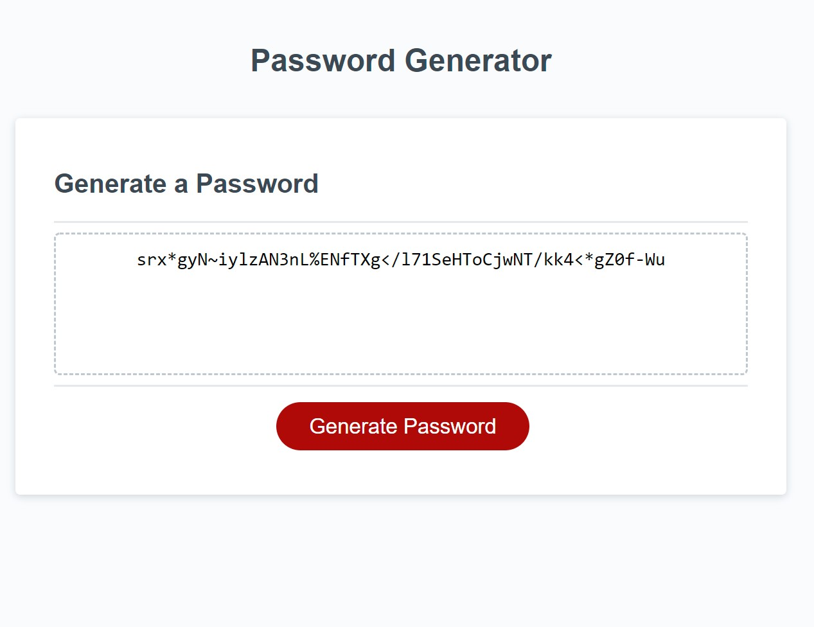

# Password Generator App - Homework 03

## Description

This is a Javascript-based application for generating a password based off user-chosen criteria including:

- What is the length of your new password (8-128 characters)?
- Would you like your password to have uppercase, lowercase, special, or numerical characters?

## Installation

- To see the project in action, visit my [Github Pages Deployment.](https://patrickbrown-io.github.io/password-generator-app-03/)

- Due to an error with submitting to Github, the early commits are available for viewing [here.](https://github.com/patrickbrown-io/Passhole-Password-Generator-03) It originally was uploaded contained in a folder, so the Github Pages did not preview the repository correctly.

## Usage

[Access the Password Generator App.](https://patrickbrown-io.github.io/password-generator-app-03/)
Load the above page and press the Generate Password button. The app will ask you for your criteria, including new password length and what characters you would like to include. After selected criteria, you will be presented with your new password.

## Credits

[Patrick Brown](https://github.com/patrickbrown-io)

Initial starter code provided by DU's Coding Bootcamp program

## Features

Driven entirely with Javascript. You can repeat multiple times with new conditions without a page refresh!
